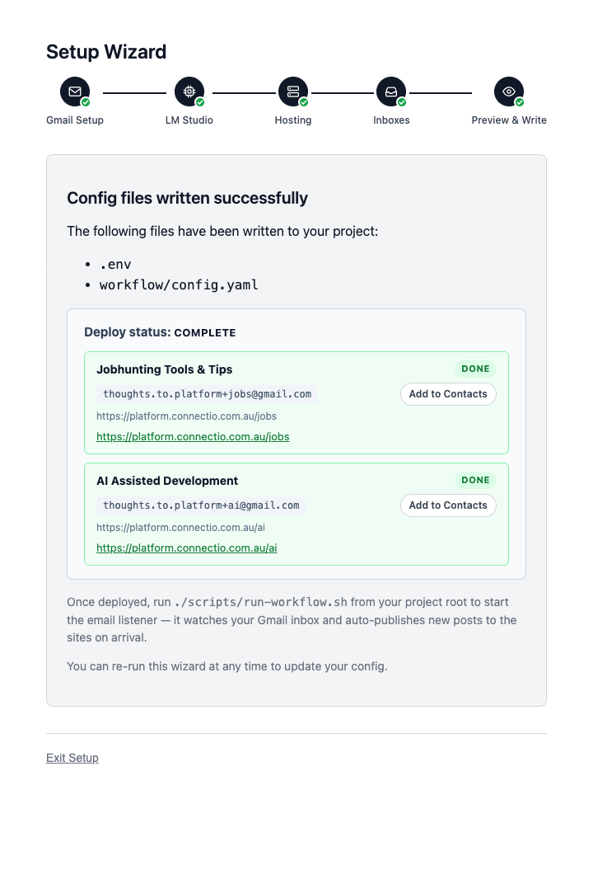
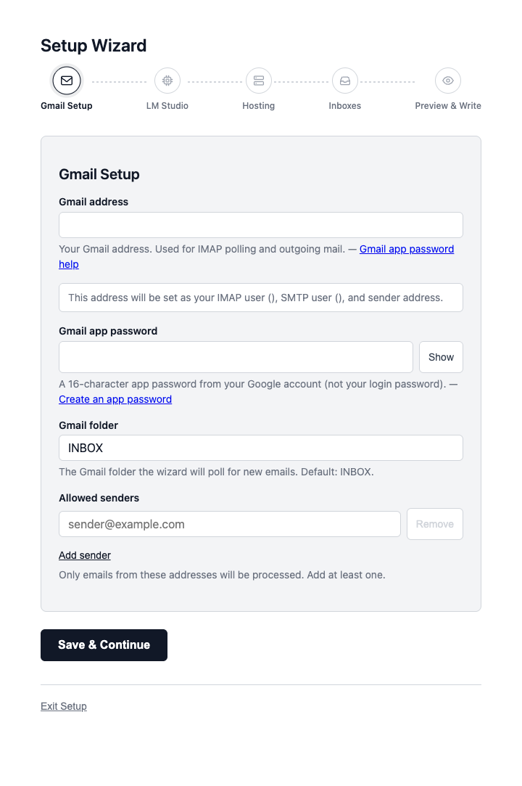
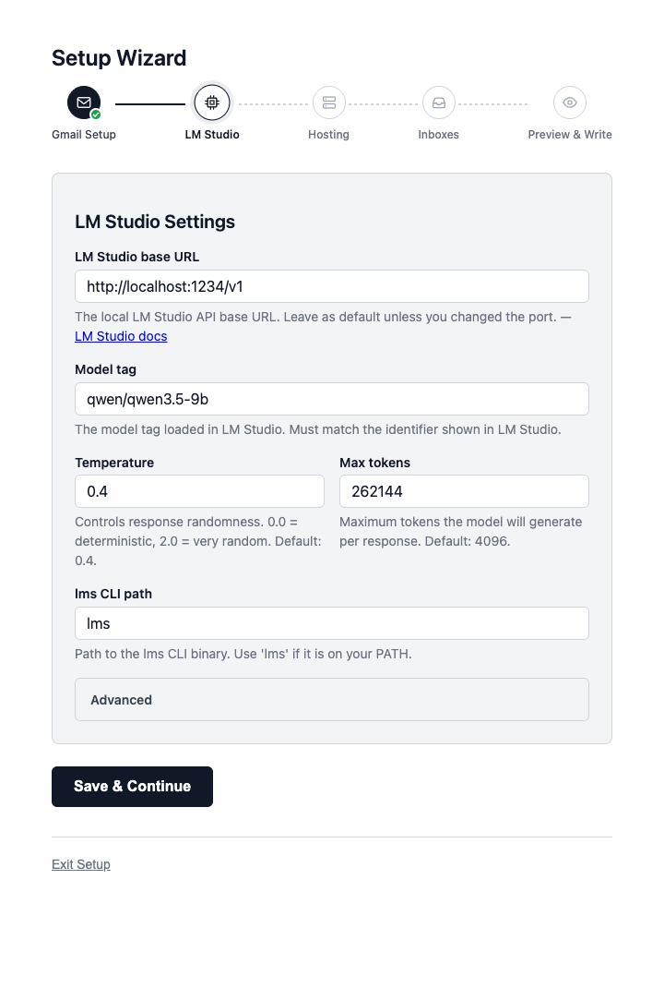
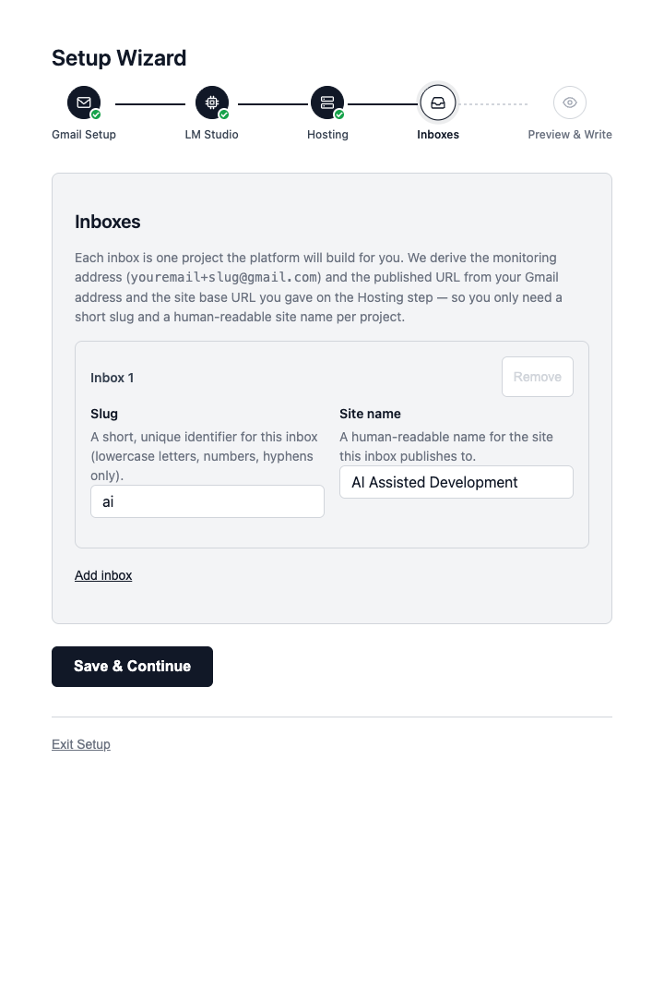
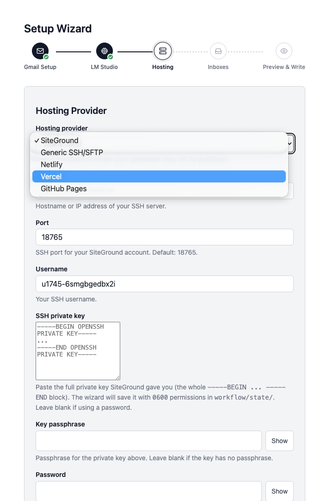
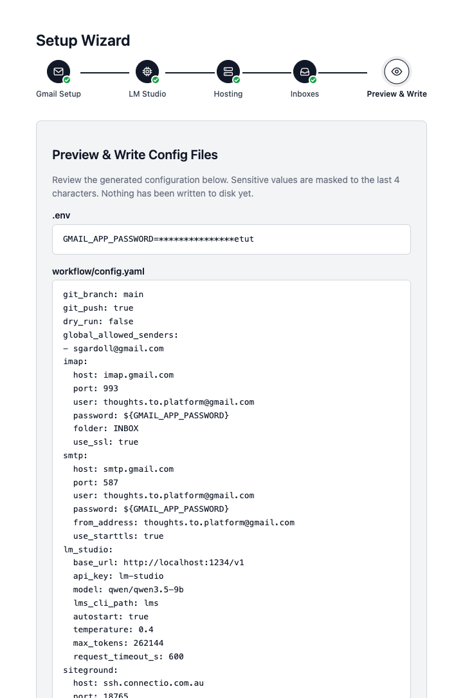

<div align="center">

# mailto.website

### Email an idea. Get a website.

**A self-extending publishing platform powered by your inbox and a local LLM.**
**Five-step setup. Zero YAML. One commit per idea.**

<br />

[](https://www.python.org/)
[](https://nodejs.org/)
[](https://astro.build/)
[](https://lmstudio.ai/)
[](LICENSE)

<br />

[**Five-step Wizard**](#-the-wizard) ·
[**How it works**](#-how-it-works) ·
[**Quick start**](#-quick-start) ·
[**Hosting**](#-hosting) ·
[**Safety**](#-safety) ·
[**Troubleshooting**](#-when-something-goes-wrong)

</div>

<br />

---

<br />

<div align="center">

> _Dedicate a Gmail plus-alias to any goal — guitar practice, parenting notes, a half-formed business idea — and that alias becomes a living website._
>
> _Forward articles. Jot voice-to-text thoughts. Paste quotes._
> _A local LLM folds each one into the existing narrative, rebuilds the site, and pushes it live._
>
> **No CMS. No editor. No "let me just open the dashboard real quick." Just send mail.**

<br />



<sub>_The wizard's done screen — five steps earlier you ran one command. Now your sites are live and your aliases are in your contacts._</sub>

</div>

<br />

---

<br />

## ✦ The Wizard

> Every other "self-hosted thing" makes you copy YAML, generate app passwords, paste API tokens, and stare at SFTP errors. **This one ships with a five-step browser wizard.**

<br />

<div align="center">

<table>
<tr>
<td width="33%" align="center">

<br /><sub><b>Step 1</b> — Gmail</sub>
</td>
<td width="33%" align="center">

<br /><sub><b>Step 2</b> — LM Studio</sub>
</td>
<td width="33%" align="center">

<br /><sub><b>Step 4</b> — Inboxes</sub>
</td>
</tr>
</table>

</div>

<br />

| Step | What you do | What the wizard does |
|:---:|:---|:---|
| **1. Gmail** | Paste your address + app password | Pings IMAP to confirm the credentials work before letting you continue |
| **2. LM Studio** | Pick a model | Auto-discovers every model loaded in your local LM Studio |
| **3. Hosting** | Choose SiteGround / Vercel / SSH | Validates the credentials, derives the deploy paths |
| **4. Inboxes** | Name each idea you want a site for | Derives the plus-alias and the site URL automatically |
| **5. Preview** | Eyeball the `.env` and `config.yaml` | Writes them atomically — and only if you click confirm |

<br />

<table>
<tr>
<td width="50%" align="center">

<br /><sub><b>Step 3</b> — Hosting picker with SSH key auto-discovery</sub>
</td>
<td width="50%" align="center">

<br /><sub><b>Step 5</b> — Preview every line of YAML before it's written</sub>
</td>
</tr>
</table>

<br />

<div align="center">

### From `git clone` to a live, listening site: **under five minutes.**

</div>

<br />

```bash
git clone <repo> && cd mailto-website
python3 -m venv .venv && .venv/bin/pip install -r apps/workflow_engine/requirements.txt
./scripts/setup.sh
```

That last command opens [`http://localhost:7331`](http://localhost:7331). The wizard takes you the rest of the way.

<br />

---

<br />

## ✦ How it works

After the wizard finishes, this is the loop that runs forever:

```
 One Gmail account, many plus-aliases  (you+guitar@…, you+parenting@…)
        │
        │  IMAP IDLE  (push, near-instant)
        ▼
 ┌──────────────────────────────────────────────────────────────────┐
 │  listener.py  →  dispatcher  →  orchestrator (per inbox)         │
 │                                                                  │
 │     ├── topic curator (LM)   updates topic.md                    │
 │     ├── synthesiser (LM)     plans entry/thread writes           │
 │     ├── apply_changes        schema-validated frontmatter        │
 │     ├── astro build          on failure → git restore rollback   │
 │     └── deploy provider      SFTP / Vercel                      │
 └──────────────────────────────────────────────────────────────────┘
```

<br />

The model operates under two prime directives, enforced in code:

> **1. Fold in, don't silo.**
> Every new entry must extend or link to an existing thread. The Astro content schema enforces this — silo'd writes don't even validate.

> **2. Take initiative.**
> Synthesise the email into something useful — questions, next steps, connections to earlier entries — never a verbatim transcription.

<br />

## ✦ Quick start

After the wizard, the listener is yours to run however you like:

```bash
./scripts/run-workflow.sh             # foreground, persistent IMAP IDLE — best for first try
./scripts/install-launchd.sh          # macOS background service
./scripts/install-systemd-user.sh     # Linux background service
```

A health endpoint runs on `http://127.0.0.1:8899/health` so you can confirm the listener is alive and which inboxes it's watching.

<br />

---

<br />

## ✦ Hosting

| Provider | Wizard auto-deploy | Notes |
|:---|:---:|:---|
| **SiteGround** (SSH/SFTP) | ✓ | Full one-click deploy from the done screen. Listener can co-locate on the same box, so processing keeps running 24/7 |
| **Vercel** | ✓ | API token; static-only host. The listener has to live elsewhere (your laptop, a VPS) and pushes to Vercel via API |
| **Generic SSH/SFTP** | manual | `python -m apps.workflow_engine.deploy_once` for now |

> _Netlify and GitHub Pages were dropped: both are static-only hosts that cannot run the IMAP listener, and the local-listener-pushes-to-static-host model adds nothing on top of Vercel for that use case._

<br />

---

<br />

## ✦ Project layout

```
apps/setup_wizard/         Flask wizard you just used. Five steps + done screen.
apps/workflow_engine/      Python pipeline. IMAP listener → dispatcher → orchestrator → deploy.
packages/site-template/    Astro 5 template. Copied to runtime/sites/<slug>/ on first email.
packages/config_contract/  Typed config schema shared by wizard + engine.
runtime/sites/<slug>/      One evolving site per inbox. LM-owned after bootstrap.
runtime/state/             listener.log, processed.jsonl, SSH keys.
scripts/                   setup.sh (wizard), run-workflow.sh (foreground), install-* (services).
docs/SETUP.md              Manual config path if you'd rather edit YAML directly.
```

<br />

---

<br />

## ✦ Safety

> The platform writes to a real website on real hosting. The safety model is intentionally conservative.

- **Sender allowlist is mandatory.** No allowlist, no processing — even if the address resolves to a configured inbox.
- **The model can only write inside `runtime/sites/<slug>/src/content/`.** Path-checked before every write.
- **Two layers of validation** — Astro's Zod content-collection schema + a second validator in `apply_changes.py`. Anything malformed is rejected before it touches the site.
- **Build failure ⟶ automatic rollback.** A broken synthesis triggers `git restore` + `git clean` so the live site never breaks. You get an email telling you exactly what failed.
- **Every successful integration is one git commit.** `git revert` is the undo button.

<br />

---

<br />

## ✦ When something goes wrong

```bash
tail -f runtime/state/listener.log              # live pipeline log
curl -s localhost:8899/health                   # is the listener alive? which inboxes?
cat runtime/state/processed.jsonl | tail        # last N messages and their outcomes
```

Full troubleshooting + the manual (no-wizard) config path live in **[docs/SETUP.md](docs/SETUP.md)**.

<br />

---

<br />

<div align="center">

### One Gmail account. Many plus-aliases. Many self-extending sites.

**Sit back and email yourself a website.**

<br /><br />

<sub>Built with Python, Astro, LM Studio, and a deeply held conviction that publishing should not require a dashboard.</sub>

</div>
